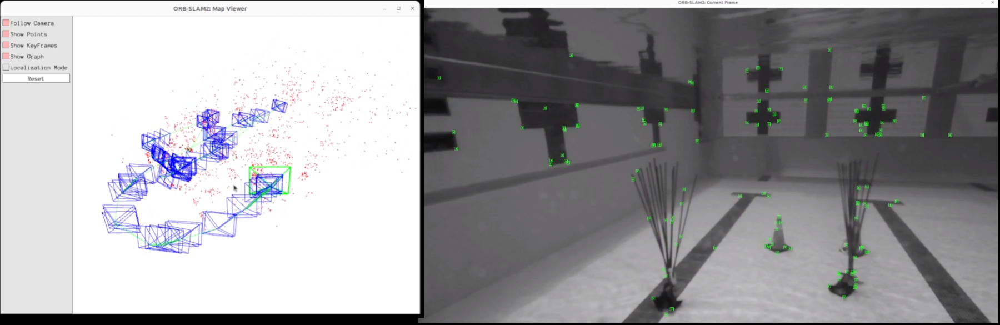
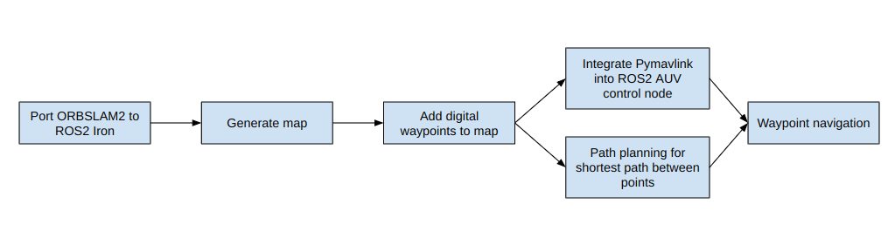
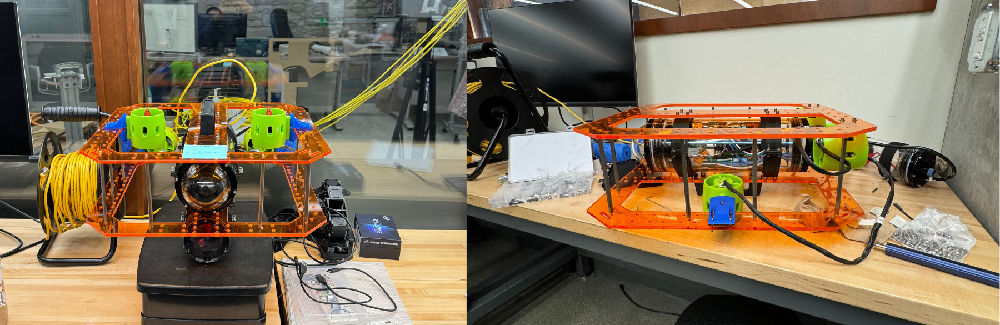
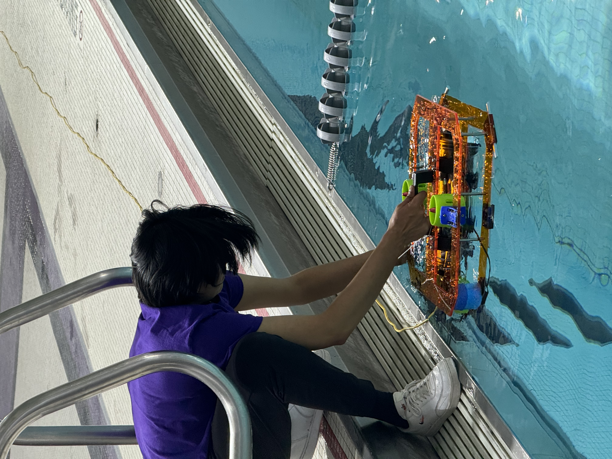
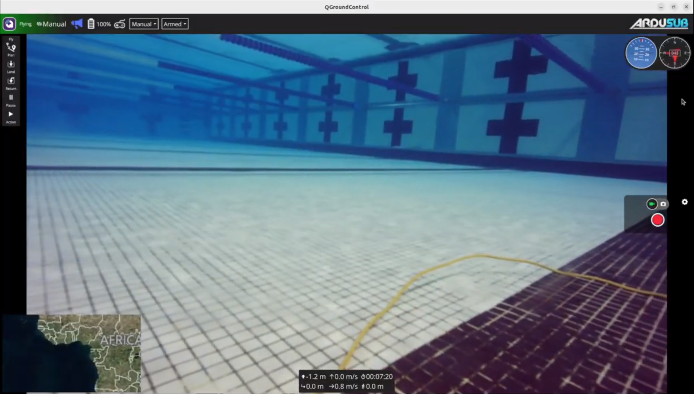
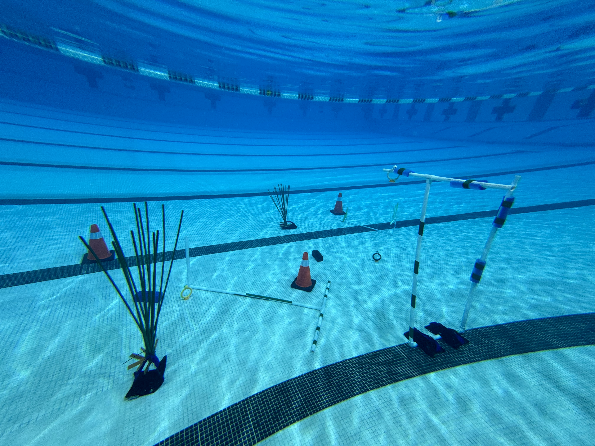
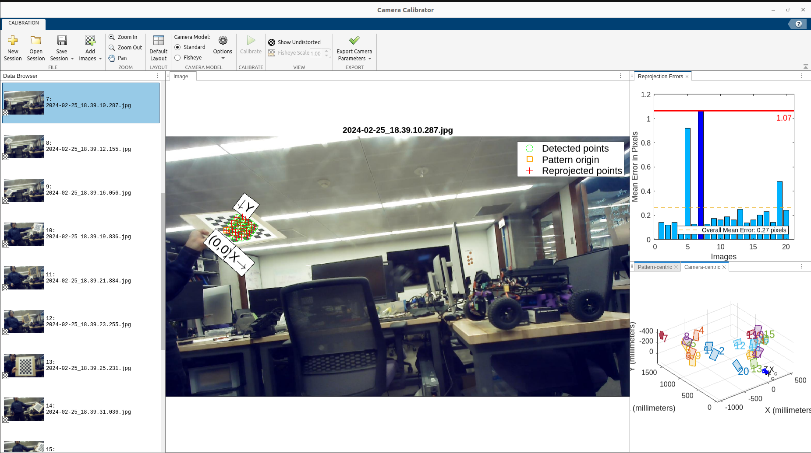
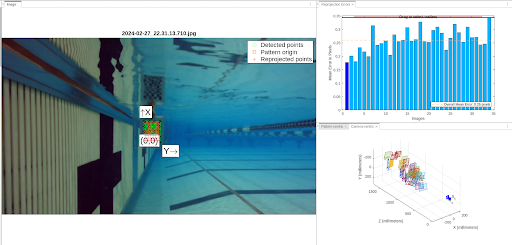
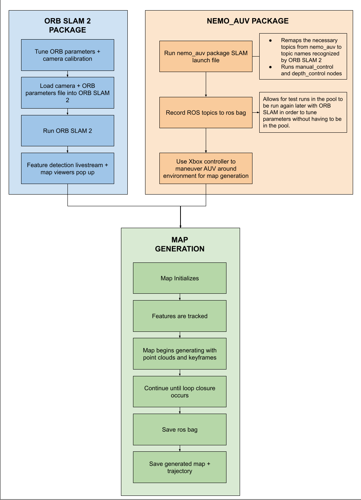

# Underwater SLAM and Waypoint Navigation with Autonomous Underwater Vehicle (AUV)
 



## **Project Brief**
In 10 weeks, I updated a low-cost underwater vehicle, ported an existing feature-based visual SLAM package into ROS2 Iron, tuned it for use in an underwater environment, and developed a ROS2 package that interfaces with ArduSub to autonomously navigate waypoints underwater.

The system was updated, tuned, and coded for use in a university pool. The ultimate purpose for this project was to develop a system that may be used for underwater mapping and directed search and inspection uses.

The following post outlines the different aspects of this project:
- Hardware and Electronics
- Manual Control
- Environment Design
- ROS Architecture
  - ORB SLAM 2 into ROS2
  - Testing and data collection
  - Control
- Simulation
- Future Work

 
<!-- project flow section here: map building -> digital waypoint -> waypoint navigation -> obstacle avoidance -->

## **Overall Project Flow**

 

## **Hardware and Electronics**
For this project I inherited the underwater vehicle that James Oubre (MSR '23) built for his independent project. This vehicle was originally built for testing done in a lab water tank, so some hardware and electronics upgrades were necessary for reliable and effective use in a university pool.

The following are the upgrades I made to the physical system:
- Improved design of motor and weight mounts
- Upgraded 3D-printed water-tight enclosures mounts to aluminum mounts
- Improved design of and lasercut new top and bottom AUV plates (added new standoff mounting holes and dive reel mount)
- Upgraded and tuned motors for better manual control
- Added servo-mounted monocular camera

 

### **Finding neutral buoyancy:**
Determining the configuration to achieve physical neutral buoyancy is important for the robot so that the AUV does not sink to the bottom of the pool or immediately return to the surface of the water when it is stationary.

The buoyancy of the AUV was altered with the addition of weights and pool noodles pieces (as shown below). 

 

  

 
 

## **Manual Control**
The first step was establishing manual control which was done by setting up the low-level control settings of the AUV through QGroundControl. Manual control was important for map generation and tuning ORB SLAM 2 as it was used as a way to test Visual SLAM live. QGroundControl was also used to tune the PID gains used by the pixhawk controller. The following picture shows the livestream feed through QGroundControl:

  

The following video showcases established manual drive and connection with QGroundControl.

<iframe width="560" height="315" src="https://www.youtube.com/embed/sCT3qU0JJ18?si=rvHk0taONFOJ48xA" title="YouTube video player" frameborder="0" allow="accelerometer; autoplay; clipboard-write; encrypted-media; gyroscope; picture-in-picture; web-share" allowfullscreen></iframe>

 

## **Environment Design**
Visual SLAM relies on edge and feature detection in an environment. As a result, when tuning the ORB SLAM 2 package to work in an underwater environment I faced the issue of noise being created by the tiles at the bottom of the pool. During testing, I also noticed a lack of discoverable features when attempting to initialize the visual SLAM algorithm in a feature-heavy environment outside of the water.

<b>Pool with underwater obstacles added</b>

  

 

<b>Feature detection with vs. without added obstacles</b>

  

The left side of the above gif proves that for a system with a monocular camera, a lack of many distinct features in the environment (especially underwater) will result in a prolonged initialization time or excess noise blocking initialization. Note that the map screen (the white window with the green box) does not initialize at all.

The right side of the above gif presents much less unwanted noise and more clear point/feature tracking during the initialization period. The map screen begins tracking the scene and the local points are visible as green dots on the obstacles in the environment. The map generation begins much more quickly and reliably as compared to in the environment without any added obstacles.

 

## **ROS Architecture**
Important packages:
- **nemo_auv**: ROS2 package I wrote to manually and autonomously control the movement of the AUV. It also conducts waypoint navigation in both simulation (RVIZ) and on the real system. 
- **ORB SLAM 2**: Existing package that allows for map generation.
- **ros2 orbslam**: Existing package that I added to in order to get it working in ROS2 Iron.

The nemo_auv package can be accessed at the github repository linked at the top of this post. This package is currently being updated to test the autonomous waypoint navigation algorithm in RVIZ simulation.
 
 

### **Implementing ORB SLAM 2 (Feature-based SLAM) Underwater**
In order to localize the AUV while conducting autonomous waypoint navigation, I am generating a map using visual odometry and depth data. The available ROS package ORB SLAM 2 calculates the camera trajectory and creates a sparse 3D reconstruction for monocular cameras.

ORB SLAM 2 was developed for ROS1, so I ported it into ROS2 Iron to make it compatible with my system. This required me to rewrite part of the ROS2 porting package for ORB SLAM. After porting the package into ROS2, my main task was tuning the ORB parameters and adjusting the package to work in an underwater environment.

The two main ways to tune the system for better underwater feature detection results are to calibrate the camera and tune the orb parameters. The pictures below display the camera calibration process in both the air and underwater. I utilized MATLAB's camera calibration app in order to visualize and minimize the reprojection errors amongst various calibration photos taken. I then converted the results of these calibrations into OpenCV calibration files for the ORB SLAM 2 package to utilize during run time.

<b>Camera Calibration in Air</b>

  

 

<b>Camera Calibration Underwater</b>

  

 

### **Testing, Data Collection, and Loop Closures**
Throughout the 10 weeks, I tuned, tested, and refined my AUV and methods during and after pool tests. Once I had established a way to launch and utilize ORB SLAM 2 with my created Nemo_AUV ROS2 package, I was able to complete one of the main goals of my project: generating a map of the underwater environment using SLAM.

This is the process I repeated in order to sufficiently tune my packages to work reliably for underwater map generation:

  

 

## **Simulating Autonomous Waypoint Navigation in RVIZ**
[coming soon]
 

## **Future Work**
- Autonomous waypoint navigation on actual AUV
- Real-time obstacle avoidance
- Map generation in darker underwater environments
 

## **Acknowledgments**
The AUV project was my own individual project, but the following people helped me with taking behind-the-scenes photos/videos and setting up the underwater environment in Northwestern's Pool:
Kyle Wang, Max Palay, Courtney Smith, Megan Black, Fiona Neylon, Kassidy Shedd, and Stella Yu. Thank you for your contributions.
 

## **Additional Videos**
The following video showcases the ROS2 package created manual/autonomous depth mode which allows users to move around the AUV without having to manually maintain depth. This mode is used to capture rosbag data to input into ORB SLAM 2 for map generation.

<iframe
 width="720"
 height="576"
 src="{{'https://youtube.com/embed/nIQ-ettAFkg?si=26ZnPv025zFOqHaE' . $video}}"
 title="YouTube video player"
 frameborder="0"
 allow="accelerometer; autoplay; clipboard-write; encrypted-media; gyroscope; picture-in-picture"
 allowfullscreen>
</iframe>

