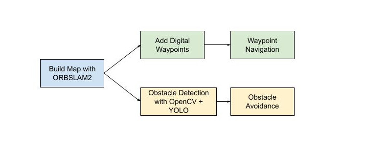
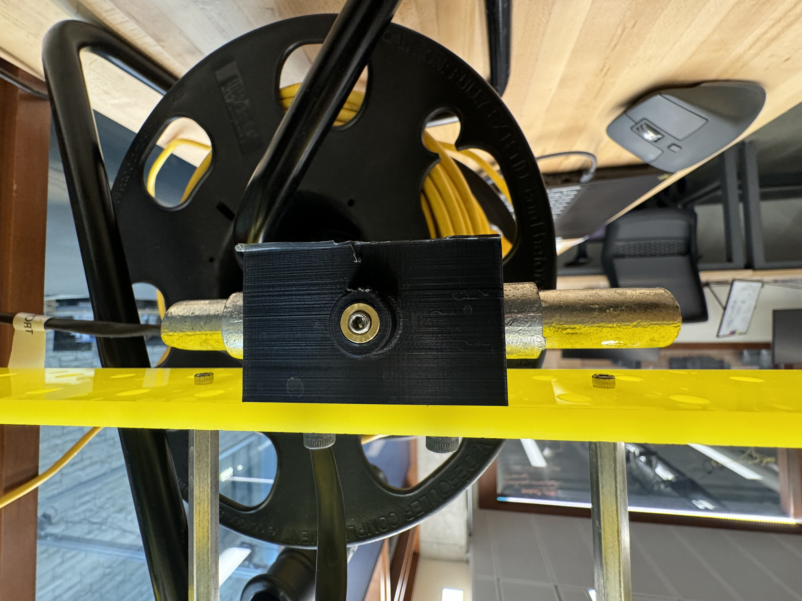
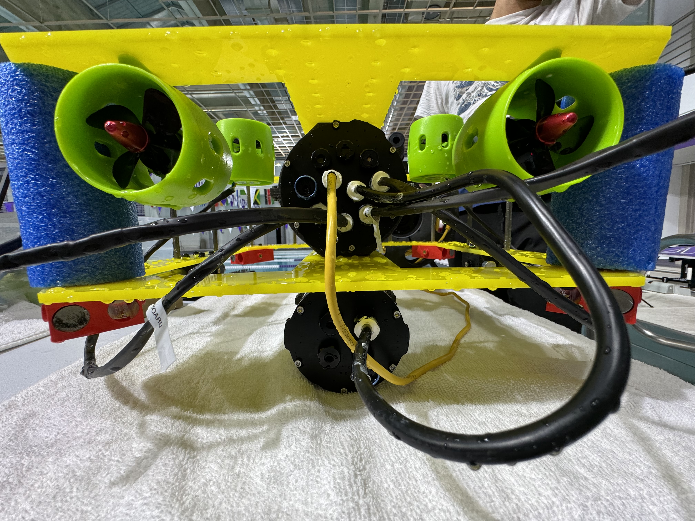

# Waypoint Navigation and Obstacle Avoidance with Autonomous Underwater Vehicle (AUV)
 

**THIS IS AN ONGOING INDEPENDENT PROJECT. THIS PAGE WILL CONTINUOUSLY BE UPDATED**
 
 

### **Project Brief**
The main goal of this project is to update a low-cost underwater vehicle and develop a ROS2 package that interfaces with ArduSub and PX4 to allow the AUV to autonomously navigate waypoints and avoid obstacles underwater.
 
<!-- project flow section here: map building -> digital waypoint -> waypoint navigation -> obstacle avoidance -->

### **Overall Project Flow**

## **Progress so far:**
Hardware:
- Determine configuration for neutral buoyancy
- Redesign, manufacture, and reconfigure hardware and electronics for AUV

Software:

- Create ROS2 package nemo_auv
- Convert QGroundControl livestream to OpenCV video frames for use with RVIZ
- Create control node for autonomous depth control

SLAM:

- Utilize ORBSLAM2 to create map for AUV to localize itself for waypoint navigation

### **Finding neutral buoyancy**
Determining the configuration to achieve physical neutral buoyancy is important for the robot so that the AUV does not sink to the bottom of the pool or immediately return to the surface of the water when it is stationary.

The buoyancy of the AUV was altered with the addition of weights and pool noodles pieces (as shown below). 

An ideal neutral buoyancy for the system is a slightly positive one.

<!--  -->
<!-- 

 -->

      
      
      

