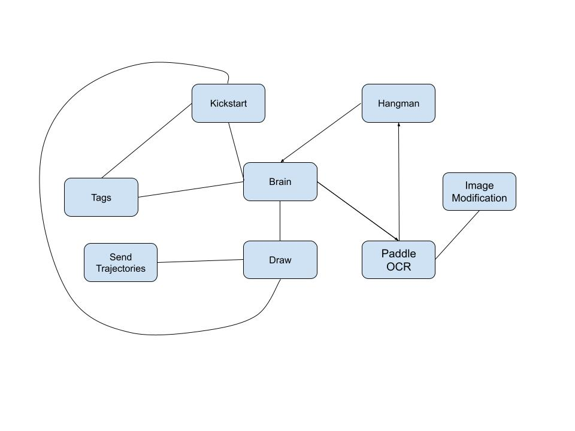

# Hangman Game Robot with Franka Emika Robot Arm
 

### **Full Demo Video**
The following video showcases a full runthrough of our project. In it, we demonstrate the robot's ability to calibrate and determine the position of the board, run through the game setup sequence while using force control, and interact with the player and receive both single letter and full word guesses.

 
 

### **Description**
The goal of this project was to use the Franka robot as a facilitator for a game of hangman. 

We developed a force control system combined with the use of april tags to regulate the pen's distance from the board as well as an Intel RealSense Camera to interact with the human player.

In this project, my main focus was developing the game setup sequence to calibrate the franka's position with respect to the board and then begin drawing the dashes for the gameplay using force control.

Group Members: Ishani Narwankar, Ananya Agarwal, Graham Clifford, Abhishek Sankar, Srikanth Schelbert
 
 

### **Overall System Architecture**
The following diagram illustrates the overall system design:

### **Quickstart Guide**
1. Install PaddlePaddle using `python -m pip install paddlepaddle-gpu -i https://pypi.tuna.tsinghua.edu.cn/simple`
2. Install paddleocr using `pip install "paddleocr>=2.0.1" # Recommend to use version 2.0.1+`
3. Install Imutils using `pip install imutils`
4. SSH into the student@station computer from the terminal after you are connected to the robot via ethernet cable.
5. On your browser open https://panda0.robot, unlock the robot, and activate FCI
6. Once the robot is unlocked and has a blue light, use `ros2 launch drawing game_time.launch.xml` to open RVIZ and start the hangman game on the robot.
 
 

### **List of Nodes**
1. Brain: 

    Interfaces with all other nodes to evaulate data.
2. ImageModification: 
    
    Modifies images for OCR using opencv.

3. Paddle_Ocr:

    Performs OCR and publishes predictions.

4. Hangman: 

    Plays the hangman game based on the OCR user input.

5. Drawing:

    Plan and execute robot paths using force control.

    Accept requests to plan trajectories for the franka robot, and subsequently send them to another node to be executed. Additionally,calculate the estimated force at the end-effector, and publish it on a topic.

6. TrajectoryExecution: 

    Execute trajectories planned for the franka robot.

    Execute trajectories planned for the franka robot at 10hz. This is a stand in for the MoveIT execute trajectory action, since MoveIT doesn't allow us to cancel goals. When a trajectory is planned by either the MoveGroup motion planner or the compute_cartesian_path service, the result is returned in the form of a RobotTrajectory message. This message includes a JointTrajectory message, which contains a list of JointTrajectoryPoint messages. We must break up this list into individual JointTrajectory messages, with just one element in the JointTrajectoryPoint list. This way, we can execute the origina RobotTrajectory discreetly by publishing JointTrajectories on the /panda_arm_controller/joint_trajectory topic.

7. Kickstart:

    Kickstart handles setting up the board for the hangman game.This includes calibrating the robot to the board, drawing the 5 lines for the word to guess, drawing the 5 lines for the 5 wrong guesses, and drawing the stand for the hangman.

8. Tags:

    This node deals with the april tags and handels tf tree. It publishes a static transform between camera and the robot, takes the arm to a specified pose and looks at the april tags on the board and publishes a board to robot transform, and gives the start pose of any letter with respect to the panda_link0.
 
 

### **Future Work**
Although our team redesigned a spring force control adapter for the Franka gripper for our fallback goal, we quickly outgrew the need for it as we began trying to implement force control. However, our project could still be significantly improved on the force control side of things. By the demo day, our team had achieved using force control to draw characters on the board but could have improved the quality of writing with more time to tune the force control parameters.

Along with improving force control, our team envisioned incorporating an extra part of the game where the robot picks up different colored pens depending on whether the player's guess is right or wrong. Due to the amount of people on our team, we actually designed and manufactured the pen stand and began writing the code to implement this part of our project. We had finalized our gripper code and had begun calibrating the robot to our april tag on the pen stand. We unfortunately ran out of time incorporating this into our final gameplay.  

Our final stretch goal that we would love to improve our project with is changing the board position between the player's turns. Due to our use of april tags and force control this could have been implemented with additional time to properly calibrate the camera's exact position with respect to the board and robot.
 
 

### **Additional Videos**
The following two videos closely demonstrate the OCR system and how player guesses are seen by the robot. 

Single letter guess:

https://github.com/ishani-narwankar/ishani-narwankar.github.io/assets/42013894/ec27aa51-53c6-486a-ab76-354bd8da277f

Full word guess:

https://github.com/ishani-narwankar/ishani-narwankar.github.io/assets/42013894/c19bd22f-539f-4213-b512-7c2ee1d56710

 
<a href="https://github.com/ishani-narwankar/hangman-with-franka">Hangmanbot GitHub Repository</a>
