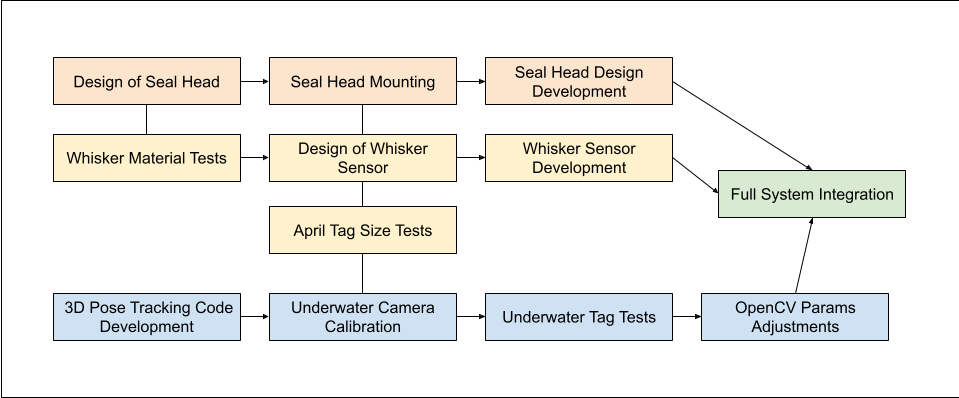
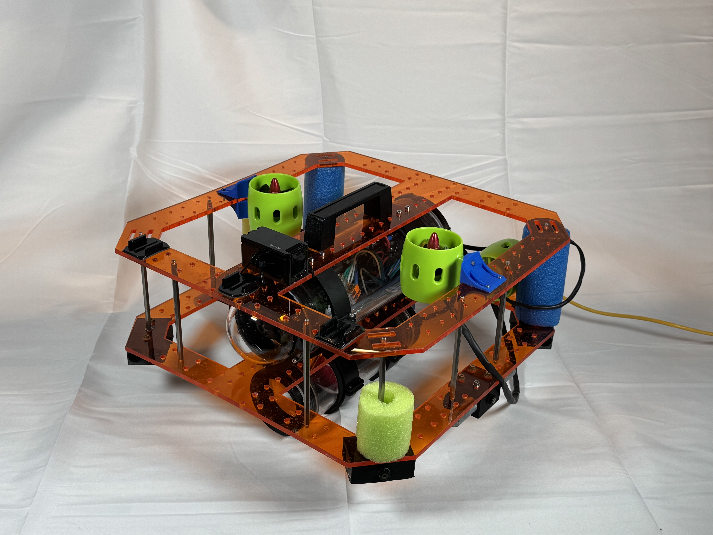
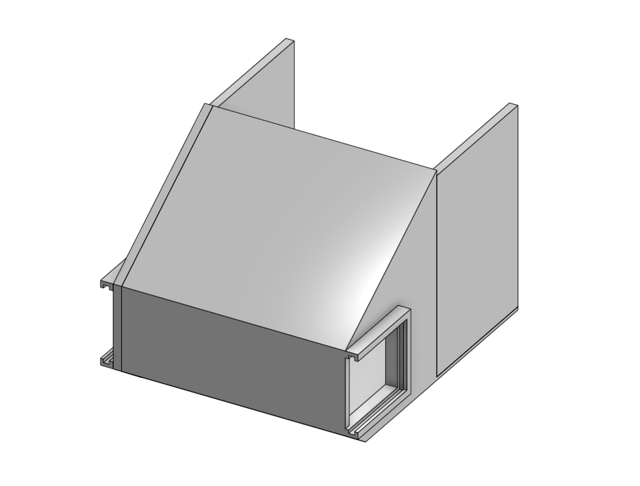
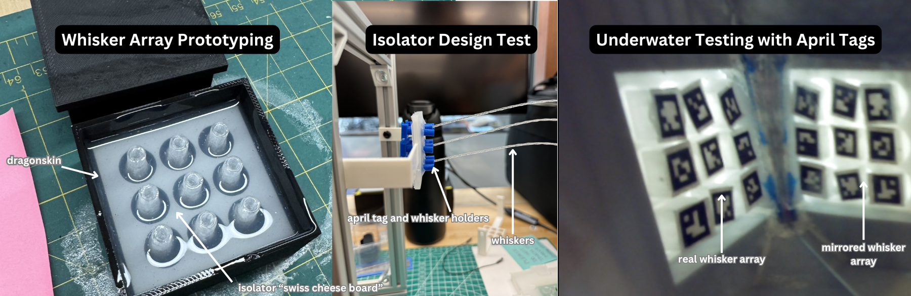
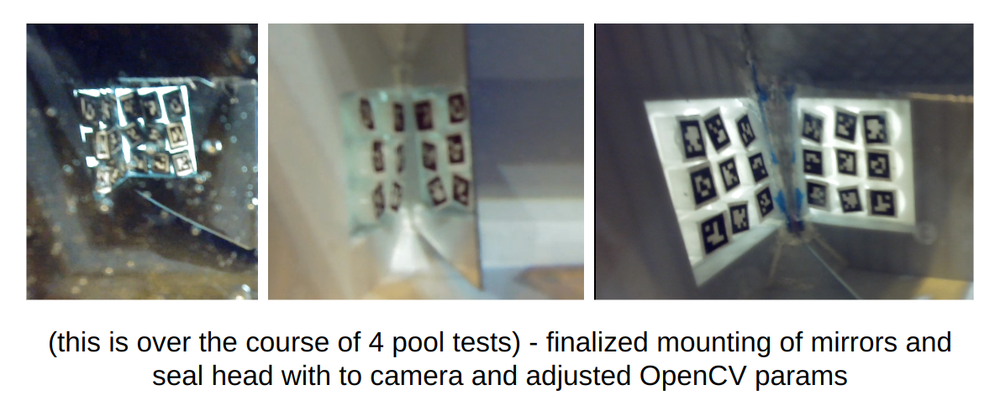
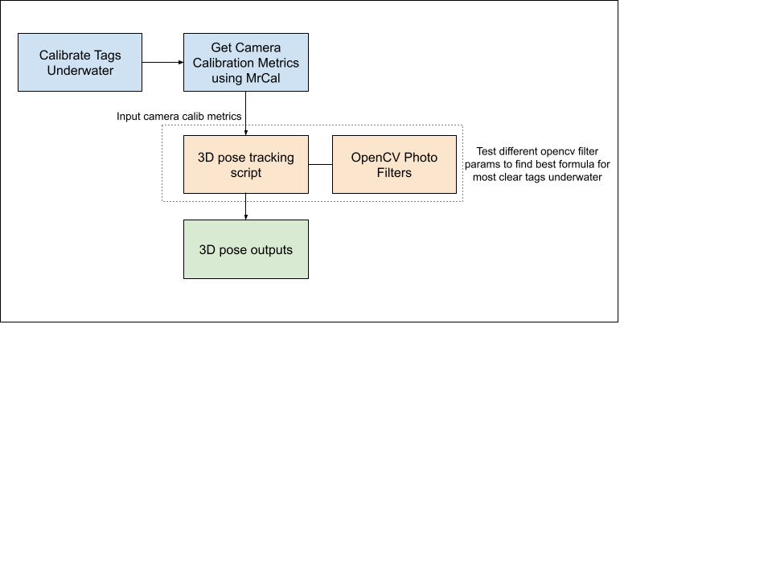

# Seal-inspired Robotic Platform for Development and Testing of Soft Robotic Whisker Sensors
 

## **Project Demo**

<iframe
 width="920"
 height="576"
 src="{{'https://youtube.com/embed/4ctWEFJlc-M?si=8hYOuG3y9vWbCVsQ' . $video}}"
 title="YouTube video player"
 frameborder="0"
 allow="accelerometer; autoplay; clipboard-write; encrypted-media; gyroscope; picture-in-picture"
 allowfullscreen>
</iframe>



## **Project Flow**

  

 
<!-- project flow section here: map building -> digital waypoint -> waypoint navigation -> obstacle avoidance -->

## **Project Overview**
- *Timeline*: 20 week project duration
- *Objective*: Build a system to test and analyze soft robotic whisker sensor array's behavior in controlled conditions
- *Key Deliverables*:
    - Refurbished ROV platform
    - Custom-designed seal head and whisker mounts
    - Test whisker arrays embedded with sensors
    - 3D pose tracking software library
 

## **ROV Hardware and Electronics Maintenance**
Tasks Completed: 
- Fixing frame and replacing damaged components
- Upgrading motors and ESCs

Challenges Faced and Solutions Implemented:
- Single motor drawing less voltage than other motors
    - Removed motor and found exposed wires that had rusted
    - Replaced with new motor
- Water leaking into electronics chamber
    - Replaced cable valves and sealed with marine sealant

  

 

## **Seal Head and Mount Design**
The main design features for the seal head are slots for whisker arrays to be swapped and mounting holes for the seal head. Since the head is printed using PLA, I was able to test a few different design iterations before landing on the one shown below.

**CAD of seal head design**

  

 

**PLA 3D printed seal head**

  

 

## **Seal Whisker Arrays and Sensors**
 
This entire seal robot platform was developed in order to test and develop the seal whisker sensors. 

These sensors are composed of three basic components: piano wire, dragon skin (silicone rubber), and april tags. 

A lot of time was spent determining the right way to go about manufacturing a whisker sensor array in a way that ensures that each sensor is isolated from the others near it.

The following whisker array test stand was devised to determine how small the april tags on the sensors could be and find a practical design solution to isolating each sensor within the array:

**Whisker Sensor Array Test Stand**

  

This gif demonstrates how when one whisker moves, the connected tag on the back will also move. 

Designing, manufacturing, and developing the whisker sensors was a full length process that included molding and curing dragonskin silicone, waterproofing 10x10mm april tags, and configuring the mirror inside of the seal head in such a way that the april tags from both left and right whisker arrays were clearly visible in the ROV camera.

## **3D Pose Tracking Software Library**
The 3D pose tracking software library was inspired and developed off of the existing april tag 3D pose tracking library found here:



The development of these scripts was carried through by numerous tests changing various OpenCV photo params in order to make the april tags more clear in the ROV camera.

  

The process of configuring and converting this repo into a working 3D pose tracker for the seal whisker sensors was as follows:

  

<!-- ## **Results**
*show the CV differences*
*show hardware changes over time*
*show tag clarity changes over time*
  -->

## **Future Work**

At the current stage, I am able to accurately track the 3D pose of the whisker sensors underwater. I am currently working with the SeNSE lab to now convert the gathered 3D pose data into the ROV's self-speed.

Another application of these whisker sensors that the SeNSE group and I are currently working towards is the detection of external disturbances. 

Using data that I gathered throughout this project, we hope to achieve these future goals.

<!-- ## **Gallery**
  -->

<!-- ## **References and Resources**
- Tools, software, and libraries used
- Acknowledgements -->

## **Acknowledgements**
The AUV project was my own individual project, but I would like to thank the following people helped me with pool test setups at the Northwestern's Pool:
Kyle Wang and Benny Zhang. 

I would also like to thank Dr. Mitra Hartmann and the members of SeNSE lab for their advice and guidance throughout my project.

