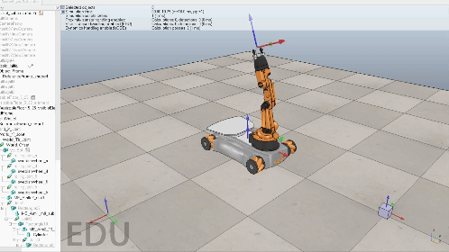
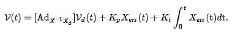
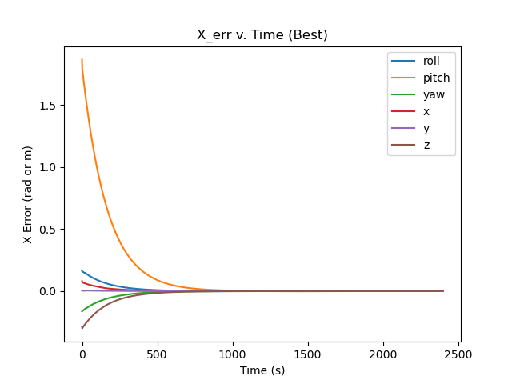
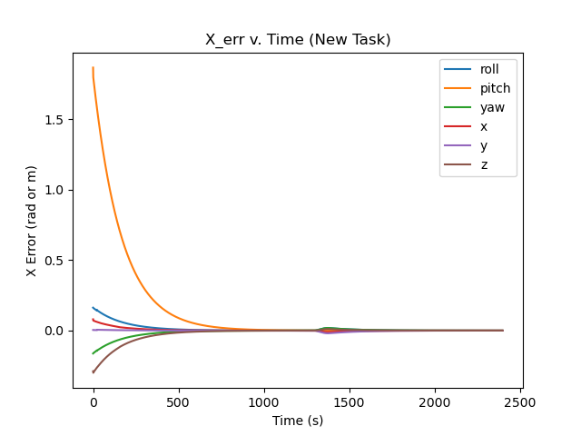
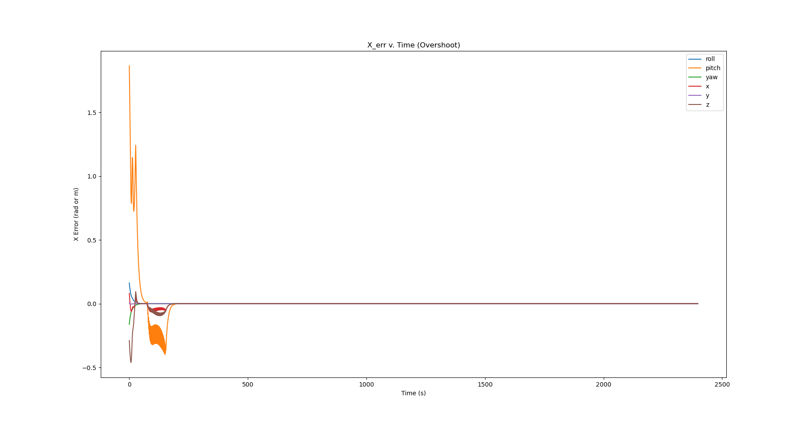

# Kuka youBot Mobile Manipulator
 

### **Project Brief**
The main goal of this project was to write software that plans a trajectory for the end-effector of the youBot mobile manipulator (a mobile base with four mecanum wheels and a 5R robot arm), performs odometry as the chassis moves, and performs feedback control to drive the youBot to pick up a block at a specified location, carry it to a desired location, and put it down. This was visualized in CoppeliaSim.
 
 

### **Best PID Control Demo**

<!-- 

    

        <video src="https://ishani-narwankar.github.io/assets/Best_run_cropped.mp4" controls style="position: absolute; top:0; left:0; width: 60%; height: 100%;"></video>
    

 -->

 
 

### **Trajectory Algorithm**
There are four functions that contribute to the working trajectory algorithm: NextState, TrajectoryGenerator, ScrewTrajectory, and FeedbackControl.
 

Using the first-order Euler equation, the **NextState** function determines the robot's configuration at the next time step.
 

The **TrajectoryGenerator** function takes in the transformation matrix of the necessary cube initial and ending waypoints and outputs a list of transformation matrices of end-effector positions in the space frame.
 

Each stage of the algorithm utilizes the **ScrewTrajectory** function which is from the modern robotics library. This function takes the starting and ending transformations of the end-effector and generates a discrete trajectory as a list of end-effector transformation matrices with the fifth-order polynomial time-scaling method.
 

Lastly, the **FeedbackControl** function is used to calculate the kinematic task-space feedforward plus feedback control law, which is written as:
 
 

 
 

### **Results**
The following cases were tested to prove the usability and reliability of the trajectory algorithm:

1. **Best**

2. **Overshoot**

3. **New Task**

 
 
