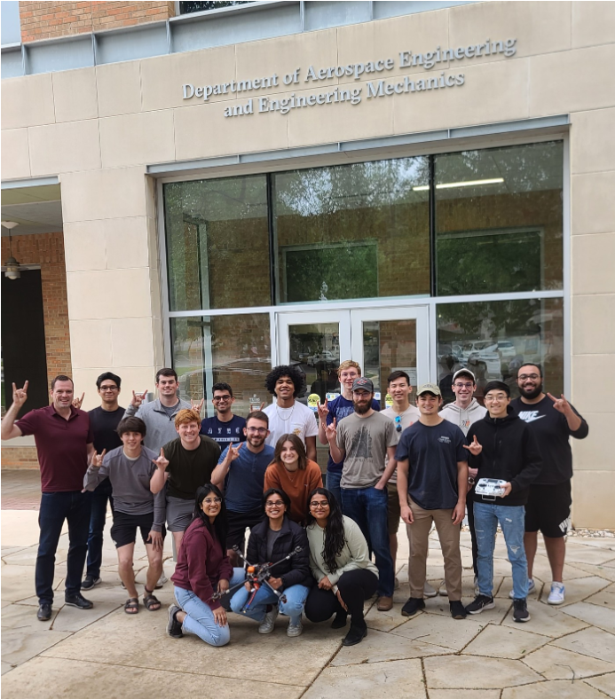

# Autonomous Drone Flight and Obstacle Avoidance in GPS-disabled Environments (Drone Estimation Lab)
 

### **Project Brief**
This project happened over the course of my 4th year (two semesters) as an Aerospace Engineering (ASE) undergradate as a part of a Senior Design Team at The University of Texas at Austin. 

This project was funded by the NASA USRC Program and received a grant for $60,000 for the development of the project. It is still continuing for future ASE senior design projects at UT Austin under the Drone Estimation Lab (DEL) which was set up by my team in 2023.

The main goal of this project is to develop a system to ensure collsion avoidance capabilities for drones in GPS-denied environments by applying space-based navigation systems.

You can read more about DEL [here](https://sites.utexas.edu/del/)
 

*The following photo showcases the DEL senior design team (under Professor Adam Nokes) throughout the 2022-2023 Academic Year - I am holding the drone in the bottom center of the photo*

  

 

### **Personal Work**
Personal work on this project includes:
- Communication and Sensors Team Lead - organized and led subteam's weekly meetings
- Designed and soldered system's electronics stack
- Designed, implemented, and calibrated system's sensor stack
- Worked on implementing 360 LiDAR for obstacle detection and state and position estimation
- Worked with other subteam leads (Audrey Smith, Shayla Patel, Nick Franken, and Stefano Bonilla) to setup Drone Estimation Lab

Throughout my senior design project, I worked on the Communication and Sensors team with Benjamin Helm and Robert Liao.

### **Project Photos and Videos**
[will be added soon]